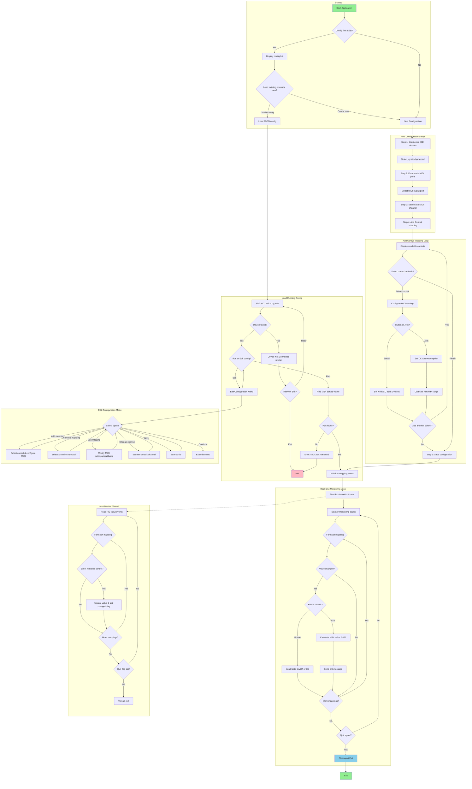
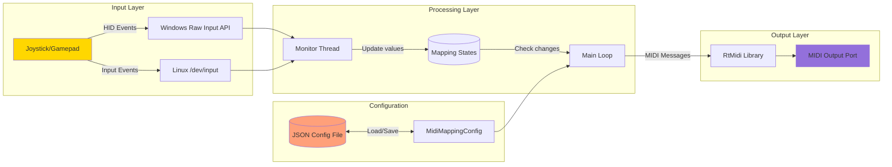

# JoystickMIDI 🎮➡️🎹

A simple cross-platform utility to map HID joystick/gamepad inputs (axes/buttons) to MIDI messages (Note On/Off or CC).

[](https://www.microsoft.com/windows)

## Features

*   **Multi-control mapping** - Map multiple joystick/gamepad buttons and axes simultaneously.
*   Map to MIDI Note On/Off or Control Change (CC) messages.
*   **Default MIDI channel** with per-mapping channel override.
*   Configure note/CC number, velocity, and output values per control.
*   Interactive axis calibration (min/max detection) and reversal.
*   Save and load configurations (`.hidmidi.json`).
*   **Edit existing configurations** - Add, remove, or modify control mappings without starting from scratch.
*   **Descriptive control names** - Displays human-readable names like "X Axis", "Throttle", "Hat Switch" instead of raw HID codes.
*   **Graceful device handling** - Prompts to connect the device if not found, with retry option.
*   Simple console interface.
*   Cross-platform support for Windows and Linux.

## Program Flow



### Data Flow



## Get Latest Release

[](https://github.com/serifpersia/joystickmidi/releases/latest)

Click the badge above to download the latest pre-compiled version for your operating system.

## Requirements

### For Windows
*   Windows 7 or later.
*   A C++ Compiler (MinGW or Visual Studio).
*   CMake.
*   Git.

### For Linux (Debian/Ubuntu-based)
*   A modern Linux distribution (e.g., Debian 12, Ubuntu 22.04).
*   `build-essential`, `cmake`, `git`.
*   Development libraries: `libasound2-dev` (for ALSA/MIDI) and `libudev-dev` (for device detection).
    ```bash
    sudo apt update
    sudo apt install build-essential cmake git libasound2-dev libudev-dev
    ```

### General
*   An HID-compliant joystick or gamepad.
*   A MIDI output device (virtual or physical).

## Getting Started (Build from Source)

1.  **Clone the repository:**
    ```bash
    git clone https://github.com/serifpersia/joystickmidi.git
    cd joystickmidi
    ```

2.  **Run the appropriate build script for your OS:**

    ### On Windows
    ```batch
    build.bat
    ```
    *   This script will check for CMake and a compiler. It may offer to install them using `winget` if not found.
    *   It downloads dependencies (RtMidi, nlohmann/json) if needed.
    *   It configures and builds the project using CMake.
    *   The final executable will be in the `build` directory (`build\JoystickMIDI.exe`).

    ### On Linux
    First, make the script executable:
    ```bash
    chmod +x build.sh
    ```
    Then, run the script:
    ```bash
    ./build.sh
    ```
    *   This script downloads dependencies if they are missing.
    *   It configures and builds the project using CMake and Make.
    *   The final executable will be in the `build` directory (`build/JoystickMIDI`).

## Usage

1.  Run the executable from your command line (`build/JoystickMIDI` or `build\JoystickMIDI.exe`).
2.  **First Run / New Configuration:**
    *   Follow the on-screen prompts to:
        *   Select your HID controller.
        *   Choose the specific button or axis you want to map (with descriptive names like "X Axis", "Throttle", etc.).
        *   Select your MIDI output port.
        *   Set the default MIDI channel.
        *   Configure the MIDI message type (Note/CC), channel, number, and values for each control.
        *   Calibrate the axis range if mapping an axis.
        *   Add as many control mappings as needed.
        *   Save the configuration to a `.hidmidi.json` file.
3.  **Load Configuration:** If `.hidmidi.json` files exist in the same directory, you'll be prompted to load one or create a new configuration.
    *   If the configured device is not connected, you'll be prompted to connect it and retry.
4.  **Edit Configuration:** After loading an existing configuration, you can choose to edit it:
    *   Add new control mappings
    *   Remove existing mappings
    *   Edit MIDI settings for any mapping
    *   Recalibrate axes or toggle reverse
    *   Change the default MIDI channel
    *   Save changes to a new or existing file
5.  **Monitoring:** Once configured (or loaded), the application will monitor the selected inputs and send MIDI messages accordingly.
    *   On Windows, close the console window to exit.
    *   On Linux, press `Enter` to exit.

## License

This project is licensed under the [MIT License](LICENSE).
